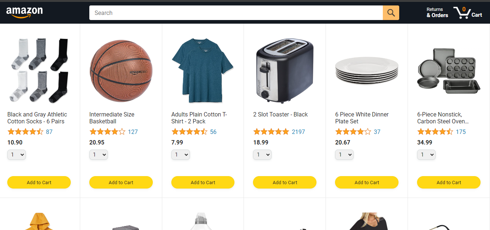

# Amazon Website Clone

This project is a clone of the Amazon website, created using HTML, CSS, and JavaScript. It mimics the basic structure, design, and some functionalities of the original Amazon website.

## Features

- **Responsive Design:** The website is fully responsive and adjusts to different screen sizes, from mobile to desktop.
- **Homepage:** A dynamic and interactive homepage with featured products and categories.
- **Product Listings:** Product grids similar to Amazon's layout, showcasing products with images, titles, and prices.
- **Navigation Bar:** A fully functional navigation bar with links to different product categories, search bar, and login options.
- **Cart Functionality:** A simple shopping cart feature that allows users to add items to the cart and view the total price.
- **Interactive Elements:** Various interactive elements using JavaScript, including dropdown menus, product sliders, and more.

## Technologies Used

- **HTML5:** For creating the structure and content of the pages.
- **CSS3:** For styling the website and making it visually appealing and responsive.
- **JavaScript:** For adding interactivity and dynamic features like sliders, cart functionality, etc.

## Screenshots


_A preview of the homepage with product listings and navigation bar._

## Getting Started

To run this project locally, follow these steps:

### Prerequisites

- A modern web browser (Google Chrome, Firefox, Safari, etc.)

### Installation

1. Clone the repository:

   ```bash
   git clone https://github.com/cykoravish/amazon-clone.git
   cd amazon-clone
   open amazon.html
  ```

## License

- This project is open-source and available under the MIT License.

- This `README.md` provides an overview of your project, instructions to get it running, and potential areas for future improvement. Adjust the project details as needed.
